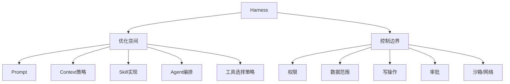

# 00｜智能体研发总纲

## 1. 目的

本规范用于统一智能体从需求、设计、Harness 开发、测试、发布到持续优化的研发方式。

目标不是约束开发者如何写 Prompt，而是确保智能体：

- 做的是正确的事；
- 覆盖真实用户的主要使用方式；
- 能在明确边界内稳定完成任务；
- 每次修改后知道是否变好、是否退化；
- 发布版本可复现、可审计、可回滚。

## 2. 第一性原则

### 2.1 产品契约高于实现方式

智能体产品的核心契约是：

> **需求 + 场景 + 输入分布 + 期望行为 + 评价标准 + 安全边界**

Prompt、Skill、Tool、MCP、Hook、Subagent、插件、工作流、模型路由等属于实现这些契约的 Harness。

### 2.2 Harness 是持续演化的实现层

Harness 应允许持续优化，不应因一次验收而被冻结。

但以下两类内容不能混为一谈：



- **优化空间**：原则上允许快速修改，以评估和回归结果约束；
- **控制边界**：必须明确、验证、版本化，未经授权不得突破。

### 2.3 用最小实验替代空想

对任何新的 Agent 设计、复杂编排、自进化机制、记忆方案、Multi-Agent 方案，都应优先回答：

> 能否先用 5～20 个真实任务样本证明它确实解决了问题？

如果单 Agent + 明确工具已经能达到目标，不增加多 Agent；如果简单规则能解决，不引入复杂规划；如果手工评估即可发现问题，不先建设评估平台。

### 2.4 真实失败比“完美设计”更有价值

所有高价值失败样本原则上应进入回归集。

研发闭环为：

```text
真实任务 → 暴露失败 → 定位原因 → 修改 Harness → 回归 → 发布 → 收集新失败
```

### 2.5 不追求“全覆盖”，追求“风险可知、重点有覆盖”

禁止使用“场景已经全部考虑”“测试已经完全覆盖”之类不可证明的表述。

应说明：

- 主要场景覆盖情况；
- 关键输入分布覆盖情况；
- 高风险边界覆盖情况；
- 已知未覆盖项；
- 剩余风险。

## 3. 规范用语

- **必须**：不满足则不得进入正式发布；
- **应当**：默认执行，若不执行需说明理由；
- **可以**：按实际收益采用；
- **禁止**：原则上不得采用。

## 4. 研发对象

### 4.1 业务能力资产

优先长期沉淀：

- 需求；
- 用户场景；
- 真实输入；
- 任务；
- 评价标准；
- 测试集与回归集；
- 历史失败样本；
- 验收结果。

### 4.2 Harness 工程资产

包括但不限于：

- Prompt / System Instructions；
- Context 管理；
- Skill；
- Tool / MCP；
- Agent / Subagent；
- Hook；
- Workflow；
- Plugin；
- Memory；
- Model Routing；
- Runtime 配置。

这些资产重要，但允许替换和演化。

### 4.3 运行控制资产

包括：

- 权限；
- Policy；
- Approval；
- 数据访问范围；
- 网络边界；
- 沙箱；
- 发布版本；
- 灰度与回滚；
- 审计记录。

## 5. 三类风险分级

只保留三档，避免复杂化。

| 等级 | 特征 | 例子 | 最低要求 |
|---|---|---|---|
| R1 低风险 | 只读、生成、建议，不直接改变业务状态 | 问答、总结、告警解释 | 能力评估 + 基线记录 |
| R2 中风险 | 可调用业务系统，但动作可逆或需人工确认 | 创建工单、生成策略草案 | R1 + 权限限制 + 关键动作审批 |
| R3 高风险 | 可直接产生重大真实后果 | 封禁、隔离、删除、修改生产策略 | R2 + 强制控制边界测试 + 回滚/审计 |

同一个 Agent 可以同时含有不同风险能力，按其最高风险动作管理。

## 6. 最小角色划分

小团队可一人兼任多个角色，不要求独立组织。

| 角色 | 核心责任 |
|---|---|
| 需求责任人 | 确认为什么做、给谁用、什么算成功 |
| Agent 开发者 | 实现和优化 Harness |
| 评估责任人 | 维护任务集、评价规则、回归结果 |
| 发布责任人 | 确认基线、安全边界和发布结果 |

R3 场景中，执行高风险动作的审批责任人不应由 Agent 自己代替。

## 7. 四条红线

1. **没有任务样本，不做复杂 Agent 设计。**
2. **没有评价标准，不以“感觉更聪明”作为优化依据。**
3. **没有安全边界，不允许 Agent 获得高风险写权限。**
4. **没有绑定发布基线的测试结果，不进入正式生产。**
