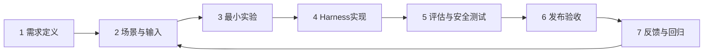

# 01｜研发流程与最小实验

## 1. 标准研发主线

智能体研发统一采用七步主线：



任何阶段都可以回退，不要求瀑布式一次完成。

## 2. 第一步：需求定义

只回答五个问题：

1. 谁在什么情况下使用？
2. 现在最痛的人工工作是什么？
3. Agent 要完成什么可观察任务？
4. 哪些事情明确不做？
5. 什么结果可以判断“值得继续做”？

需求若仍停留在“做一个 XXX 智能体”，不得直接进入复杂设计。

## 3. 第二步：场景与输入

至少准备：

- 3 个最常见场景；
- 2 个异常或边界场景；
- 5～20 条真实或高度接近真实的用户输入。

不是先写 Prompt，再想用户怎么用；而是先看用户会怎么输入，再决定 Harness 怎么设计。

## 4. 第三步：最小实验

### 4.1 目标

快速验证一个假设：

> “使用某种最小 Harness，是否已经能够显著改善目标任务？”

### 4.2 默认最小实现顺序

按从简单到复杂尝试：

```text
单次模型调用
→ 模型 + 明确上下文
→ 模型 + Tool
→ Skill / Workflow
→ 多 Agent
→ 长期记忆 / 自进化
```

后一级只有在前一级无法满足要求时才引入。

### 4.3 最小实验输出

只需记录：

- 假设；
- 测试样本；
- 当前方案；
- 结果；
- 主要失败；
- 是否继续。

禁止为了试验先建设完整后台、资产中心、复杂 Agent 管理平台。

## 5. 第四步：Harness 实现

Harness 开发应围绕已经暴露的问题进行。

推荐变更方式：

```text
发现失败模式
→ 判断根因
→ 选择最小修改点
→ 修改一个主要变量
→ 重新评估
```

尽量避免一次同时大改 Prompt、模型、工具和流程，否则无法判断是什么产生效果。

## 6. 第五步：评估与安全测试

至少回答两类问题：

### 能力

- 能否完成主要任务？
- 关键事实是否正确？
- 是否符合输出结构？
- 是否覆盖主要输入变化？

### 边界

- 会不会越权？
- 会不会绕过审批？
- 会不会执行不允许的高风险动作？
- 工具失败时是否进入安全状态？

## 7. 第六步：发布验收

发布不是审核每一个 Prompt 句子，而是确认：

```text
需求版本
+ 评估集版本
+ Harness版本
+ 模型/Runtime版本
+ Policy版本
+ 测试结果
= 本次可复现发布基线
```

## 8. 第七步：反馈与回归

生产问题分三类：

| 类型 | 处理方式 |
|---|---|
| 能力失败 | 转成任务样本，进入回归集 |
| 产品需求变化 | 回到需求/场景定义 |
| 安全边界问题 | 立即修正控制层并补安全测试 |

## 9. 何时停止继续设计

满足以下条件时，应优先上线小范围试用，而不是继续“优化架构”：

- 主要场景已能工作；
- 已知关键失败有明确兜底；
- 高风险动作已受控；
- 有基本回归集；
- 新增复杂度的收益已经不明确。
