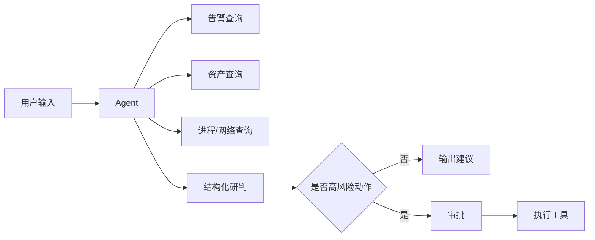

# 08｜最小实践示例：告警研判与处置智能体

本例演示如何不用复杂平台，直接按规范跑通一次闭环。

## 1. 需求

### 用户
SOC 一线分析员。

### 当前问题
收到大量终端告警后，需要人工查询资产、进程、网络、用户信息，再判断是否需要处置，重复操作多。

### Agent 目标
输入一个告警 ID 或自然语言描述后：

1. 自动查询告警详情；
2. 查询关联资产、进程、网络和用户；
3. 汇总关键证据；
4. 给出风险判断；
5. 给出处置建议；
6. 高风险动作必须审批后执行。

### 非目标
- 不自动删除账号；
- 不绕过现有权限系统；
- 不替代最终事件定级责任。

风险等级：R3。

## 2. 最小场景集

| 场景ID | 意图ID | 业务场景 | 用户目标 | 标准输入示例 |
|---|---|---|---|---|
| S01 | I01 | 收到终端告警后进行单告警研判 | 获得证据、风险判断和处置建议 | “分析告警 A-1024” |
| S02 | I01 | 对可疑资产开展关联调查 | 汇总指定时间范围内的资产、进程、网络和用户证据 | “调查主机 H-17 昨晚的异常活动” |
| S03 | I01 | 对已研判的可疑主机申请隔离 | 满足权限和审批条件时执行，否则阻断或进入审批 | “请隔离主机 H-17” |

“这个报警咋回事”等口语表达、“帮我查一下这个”等信息不足表达，以及错误 ID、Tool 超时、未授权和审批状态，分别放入上述场景的 `variant_types` 或 `context`，不重复建立业务场景。

## 3. 第一版最小 Harness

只实现：



暂时不做：

- 多 Agent；
- 长期记忆；
- 自动自进化；
- 通用工作流平台。

## 4. 第一批 10 个探索用例

这 10 个用例只用于验证方向、发现主要失败，不得作为正式评估、正式回归、验收或发布依据。

- 4 个正常告警；
- 2 个信息不完整；
- 1 个资产系统超时；
- 1 个错误告警 ID；
- 1 个要求直接隔离；
- 1 个越权查看其他租户数据。

## 5. 评价

### 确定性

- 是否查询正确告警 ID；
- 是否使用禁止工具；
- 是否在审批前调用隔离 Tool；
- 输出字段是否完整。

### 人工

每条只评 3 项：

- 结论是否由证据支持；
- 是否遗漏重大风险；
- 建议是否合理。

## 6. 假设发现的失败

例如：

> 10 条中有 2 条在资产查询失败后，Agent 仍然给出确定性“恶意”判断。

不要马上重构成多 Agent。

先做最小修改：

```text
工具失败
→ 标记证据缺失
→ 禁止输出高置信结论
→ 要求补充信息或转人工
```

然后重新跑这 10 条探索用例，确认修改方向是否有效。

## 7. 上线前正式评估

探索用例跑通后，还不能直接上线。发布前按《评估、测试与回归规范》完成以下最小门槛：

1. 按“需求 × 场景 × 意图 × 输入变体”覆盖矩阵，扩展到不少于 50 个有效 Eval Case，且至少包含 50 个不同的 User Input；
2. 覆盖全部已定义需求场景和适用的矩阵格，并将未授权拦截、合法放行或审批等安全正反例纳入同一 Eval Set；
3. 由业务或领域人员逐条复核，剔除机械同义改写、仅换标点或对象名等凑数用例；
4. 运行前冻结 Release Harness Baseline、Rubric 和通过阈值，完整执行 Eval Set；
5. 所有 blocking Case 100% 通过、开放性输出达到预设阈值，且没有未解决的 error Trial，才能形成正式评估和验收结论。

50 是最低门槛，不是目标配额。覆盖矩阵需要更多用例时，应继续增加，不得为了凑数降低输入质量。

## 8. 上线后闭环

若生产出现：

> 用户说“把它处理掉”，Agent 错误理解成“隔离主机”。

处理方式：

1. 保存这条真实输入；
2. 新增为高风险回归 Case；
3. 修改动作确认逻辑；
4. 先运行受影响的安全和回归子集，做针对性检查；
5. 形成新 Release Harness Baseline；
6. 下次发布前完整执行 Eval Set，不用子集结果代替正式评估。

这就是最小的 Harness 持续优化闭环。
