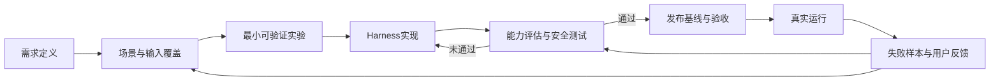

# 智能体研发规范

**版本：** v1.1 
**文档属性：** 智能体研发与交付规范  
**适用范围：** 适用于基于 DSH、AgentScope、Claude Code、Codex、LangGraph 等智能体产品、框架或 Runtime 开展的智能体研发、测试、发布、验收与持续优化活动；既适用于内部应用，也适用于对外交付场景。

> **核心原则：以能力与安全边界作为验收核心，以运行基线保证可复现、可审计和可回滚；Harness 实现允许在受控条件下持续优化。**

## 一、规范定位与目标

本规范用于建立一套统一、可执行、可验证、可追溯的智能体研发与交付方法，使研发活动从真实需求和真实使用场景出发，通过最小可验证实验快速获得事实依据，并以评估、回归、安全控制和发布基线支撑持续迭代。

规范强调工程措施应与业务复杂度、风险等级和交付阶段相匹配。对于尚未被实际问题证明必要的流程、平台和机制，原则上不提前扩展；优先通过小规模实验验证需求、方案和风险，再根据验证结果逐步增加工程控制。其目标不是减少必要的工程要求，而是避免缺乏事实依据的复杂化建设。

总体遵循以下原则：

1. **需求与用户价值导向**：所有 Harness、工具、流程和平台建设均应服务于明确的业务目标和用户任务。
2. **最小验证优先**：对于尚未验证的设计判断，优先采用小规模、可重复的实验获得证据，再决定是否扩大实现范围。
3. **能力验收为主**：智能体是否满足交付要求，主要依据需求、场景、输入覆盖、任务表现、评估结果和安全约束进行判断。
4. **控制边界强约束**：权限、数据范围、外部系统调用、高风险动作、审批、沙箱等直接影响真实业务后果的能力必须明确并验证。
5. **实现持续可变**：Prompt、Skill、Agent 编排、Context 策略、工具选择等 Harness 实现允许持续优化，但每次变更均应接受与风险相匹配的评估和回归验证。
6. **发布必须可复现**：正式发布版本应绑定确定的模型、Harness、策略、工具、依赖、评估数据和运行环境基线，确保问题能够定位、版本能够回退、结果能够复核。
7. **失败样本持续回流**：真实运行中的失败、偏差和高价值反馈应转化为新的 Eval Case，并在统一 Eval Set 中标记为 `regression`，使研发资产随实际使用持续积累。

## 二、总体研发闭环

智能体研发以“需求—验证—实现—评估—发布—反馈”为主线。Harness 是实现和优化智能体能力的工程载体，不应脱离任务与评估单独演进。

研发过程中，应优先证明以下问题：

- 需求是否真实、明确且具有可验证的成功标准；
- 主要用户场景和关键输入类型是否得到覆盖；
- 当前 Harness 是否已经达到可接受的能力水平；
- 高风险动作是否受到明确、可验证的控制；
- 修改 Harness 后是否出现能力或安全退化；
- 正式发布版本是否能够被准确识别、复现和回滚。

## 三、规范文档体系

| 文件 | 主要内容 | 使用定位 |
|---|---|---|
| `00_总纲.md` | 定义适用范围、核心原则、研发对象、角色和强制要求 | **基础规范** |
| `01_研发流程与最小实验.md` | 规定从需求提出、最小实验到正式发布的研发路径 | **核心流程** |
| `02_需求定义与场景输入规范.md` | 将业务需求转化为可验证的场景、输入和任务 | **核心输入** |
| `03_Harness开发与变更规范.md` | 规范 Prompt、Skill、Tool、MCP、Agent 编排等 Harness 的开发与变更 | **实现规范** |
| `04_评估测试与回归规范.md` | 规定能力评估、统一 Eval Set、回归用例、失败样本管理与发布门槛 | **核心验证** |
| `05_安全控制边界规范.md` | 规定权限、数据、审批、沙箱、高风险操作等控制要求 | **强制控制** |
| `06_发布基线与验收规范.md` | 规定版本基线、发布、验收、追溯和回滚要求 | **交付规范** |
| `07_六件套模板.md` | 提供研发与验收过程中的标准模板 | **执行模板** |
| `08_最小实践示例_告警研判与处置.md` | 通过完整案例说明规范如何应用于实际智能体 | **实践参考** |
| `09_研发检查清单.md` | 提供开发、评审、测试和发布阶段的快速核对项 | **执行检查** |

## 四、核心研发与交付成果

智能体交付以能力表现、安全边界和可复现性为核心依据。Harness 实现配置应纳入版本记录和变更控制，但原则上不以 Prompt、Skill、工具编排等具体写法作为业务能力的主要验收对象。

规范定义以下六类核心成果：

| 成果 | 主要回答的问题 | 管理要求 |
|---|---|---|
| 《智能体需求定义》 | 为什么做、为谁做、解决什么问题、成功标准是什么 | **主验收依据** |
| 《用户场景与输入覆盖矩阵》 | 真实用户会如何使用，主要与高风险输入是否覆盖 | **主验收依据** |
| 《任务与评估数据集说明》 | 用什么任务和数据证明智能体能力 | **主验收依据** |
| 《安全与控制边界清单》 | 智能体允许做什么、禁止做什么、哪些动作必须审批 | **强制控制项** |
| 《Release Harness Baseline》 | 本次评估和发布对应哪一套实际运行实现 | **复现、审计与回滚依据** |
| 《能力评估与验收报告》 | 当前版本是否达到既定能力、安全和发布标准 | **最终验收依据** |

六类成果之间应保持可追溯关系：需求能够映射到场景，场景能够映射到任务与测试，测试结果能够关联到确定的运行基线，未通过项能够回到 Harness 进行针对性改进。

## 五、Harness 的管理边界

Harness 应区分“可持续优化的实现空间”和“必须受控的运行边界”，避免将所有配置采用相同方式管理。

| 类型 | 典型内容 | 管理方式 |
|---|---|---|
| **优化空间** | Prompt、Context 组织、Skill 实现、Agent 分工、工具选择策略、工作流编排、模型调用策略 | 允许持续调整，以评估和回归结果约束 |
| **控制边界** | 数据权限、工具权限、网络访问、写操作范围、高风险动作、审批策略、沙箱、凭据使用范围 | 明确定义、强制验证、变更受控 |
| **运行基线** | 模型版本、Harness 版本、工具/MCP/插件版本、策略版本、评估集版本、运行环境 | 发布时锁定并记录，用于复现、审计和回滚 |

因此，本规范所称“不过度验收 Harness 实现”，并不意味着 Harness 不受管理。其含义是：**不以人工检查具体实现写法替代能力验证；对于影响安全和运行结果的配置，则必须纳入控制和基线管理。**

## 六、实施方式

规范采用渐进实施原则。研发活动应首先建立能够完成真实任务验证的基本闭环，再根据业务风险、使用规模、协作复杂度和交付要求逐步增强自动化与平台能力。

在项目早期，应优先具备以下基础能力：

- 使用版本控制保存 Agent 与 Harness 变更；
- 选取具有代表性的真实任务和用户输入作为验证样本；
- 建立能够重复执行的基本评估与回归机制；
- 对权限、数据访问和高风险动作形成明确的控制边界；
- 对进入测试或生产环境的版本建立唯一、可追溯的发布标识；
- 将实际运行中发现的重要失败案例补充为 Eval Case，并在统一 Eval Set 中按需标记为 `regression`。

当人工执行已经能够稳定暴露真实问题，并且重复操作开始产生明显成本时，再考虑引入自动评估流水线、版本管理服务、观测平台、灰度发布、审批编排等进一步工程化能力。平台建设应由实际研发瓶颈和风险控制需求驱动，而不应先于问题本身。

## 七、规范使用要求

不同阶段可采用不同的文档深度，但不得省略与当前风险直接相关的关键内容：

本规范中的 5～20 条用户输入仅用于探索实验和验证方向，不得据此形成正式评估、正式回归或验收结论。正式评估、正式回归和验收必须同时包含不少于 50 个有效 Eval Case 和不少于 50 个经质量审查的不同 User Input；用例质量、覆盖范围和判定门槛统一见《04_评估测试与回归规范》。

- **探索验证阶段**：重点完成需求、代表性场景、最小实验和探索检查，快速判断方向是否成立；
- **工程开发阶段**：补充 Harness 版本管理、回归测试和控制边界，确保持续修改不会造成不可见退化；
- **发布交付阶段**：形成完整发布基线，执行能力与安全验收，并输出正式验收报告；
- **持续运营阶段**：持续收集真实输入、失败样本和用户反馈，更新评估集，并驱动下一轮 Harness 优化。

所有新增流程、控制项或平台能力，都应能够回答至少一个明确问题：**它解决了什么已经出现或可以合理预见的风险，能够提供什么可验证的收益。** 无法回答该问题的机制，原则上不纳入当前阶段建设范围。

---

本规范的核心不是固化某一种智能体框架或 Harness 形态，而是建立一套能够跨 DSH、AgentScope、Claude Code、Codex、LangGraph 等实现持续工作的研发与验收方法。框架和 Harness 可以演进，需求、场景、评估、安全边界及真实运行反馈应持续沉淀并保持可追溯。
